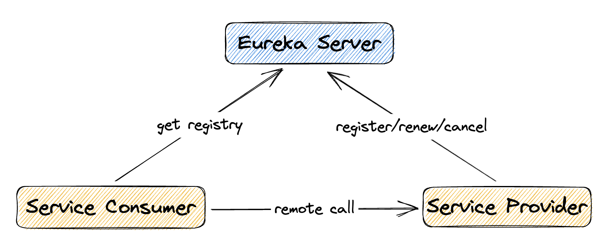

### Eureka
#### 1 - 服务治理
在传统的 RPC 远程调用框架中，管理每个服务与服务之间依赖关系比较复杂，管理比较复杂，
所以需要使用服务治理，管理服务于服务之间依赖关系，可以实现服务调用、负载均衡、容错等，实现服务发现与注册。

#### 2 - 服务注册与发现
Eureka 采用了 CS 的设计架构，Eureka Server 作为注册功能的服务器，它是服务注册中心。
而系统中的其他微服务，使用 Eureka 的客户端连接到 Eureka Server 并维持心跳连接。
这样系统的维护人员就可以通过 Eureka Server 来监控系统中各个微服务是否正常运行。

实质: key=服务名, value=调用地址

1. Provider 在注册中心注册服务
2. Consumer 在注册中心获取服务
3. Consumer 远程调用对应的服务

#### 3 - Eureka 两个组件

**Eureka Server**: 提供服务注册

各个微服务节点通过配置启动后，会在 EurekaServer 中进行注册，这样 EurekaServer 中的服务注册表
中将会存储所有可用服务节点的信息，服务节点的信息可以在界面中直观看到。

**Eureka Client**: 通过注册中心进行访问

Java 客户端，内置一个轮训负载算法的负载均衡器。在应用启动后，将会向 Eureka Server 发送心跳 (默认 30 秒)
如果 Eureka Server 在多个心跳周期内没有接收到某个节点的心跳，Eureka Server 将会从服务注册表中把这个服务节点移除

启动步骤：
1. 先启动 eureka 注册中心
2. 启动服务提供者 payment 支付服务
3. 支付服务启动后会把自身信息（比如服务地址以别名的方式）注册到 eureka
4. 消费者 order 服务在需要调用接口时，使用服务别名去注册中心获取实际的 RPC 远程调用地址
5. 消费者获得调用地址后，底层使用 HttpClient 技术实现远程调用
6. 消费者获得服务地址后会缓存在本地 JVM 中，默认每间隔 30 秒更新一次服务调用地址

#### 4 - Eureka 集群

微服务 RPC 远程服务调用最核心的是: **高可用**。

解决办法: 搭建 Eureka 注册中心集群，实现负载均衡+故障容错

#### 4.1 - Eureka 保护机制

某时刻某一个微服务不可用，Eureka 不会立即清理，依旧会对该微服务的信息进行保存。

**属于 CAP 里面的 AP 分支**

#### 4.2 - 为什么会产生自我保护机制？

为了防止 EurekaClient 可以正常运行，但是与 EurekaServer 网络不通的情况下，EurekaServer 不会立刻将 EurekaClient 剔除

#### 4.3 - 什么是自我保护模式？

默认情况下，如果 EurekaServer 在一定时间内没有接收到某个微服务实例的心跳，EurekaServer 将会注销该实例（默认 90 秒）。
但是当网络分区故障发生（延时、卡顿、拥挤）时，微服务与 EurekaServer 之间无法正常通信。 服务本身其实是健康的，此时本不应该注销这个微服务。
Eureka 通过"自我保护模式"来解决这个问题——当 EurekaServer 节点在短时间内丢失过多客户端时（可能发生了网络分区故障），那么这个节点就会进入自我保护模式。

在自我保护模式中，Eureka Server 会保护服务注册表中的信息，不再注销任何服务实例。

它的设计哲学就是宁可保留错误的服务注册信息，也不盲目注销任何可能健康的服务实例。

